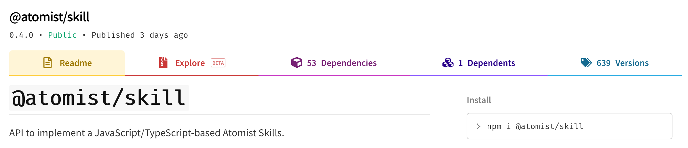

In a typical release flow for NPM packages, you will publish pre-release
versions that people can test. Once you are happy with a pre-release version,
you would like to promote it to a release version, to make it easier for
everyone to use. This skill facilitates that flow by automating it.

When a tag is pushed to a selected repository that looks like a release
[semantic version][semver], this skill looks for a pre-release semantic version
tag on the same commit, downloads that pre-release version package, unpacks the
package, sets the version in the package to the release version, and then
publishes the release version package.

[semver]: https://semver.org/ "Semantic Versioning"

### Published package

