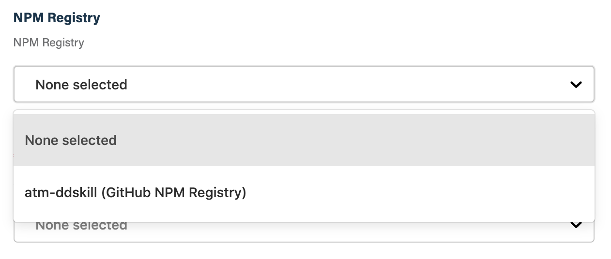
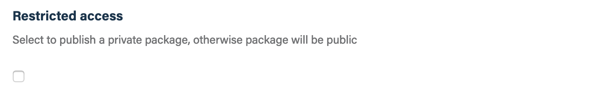
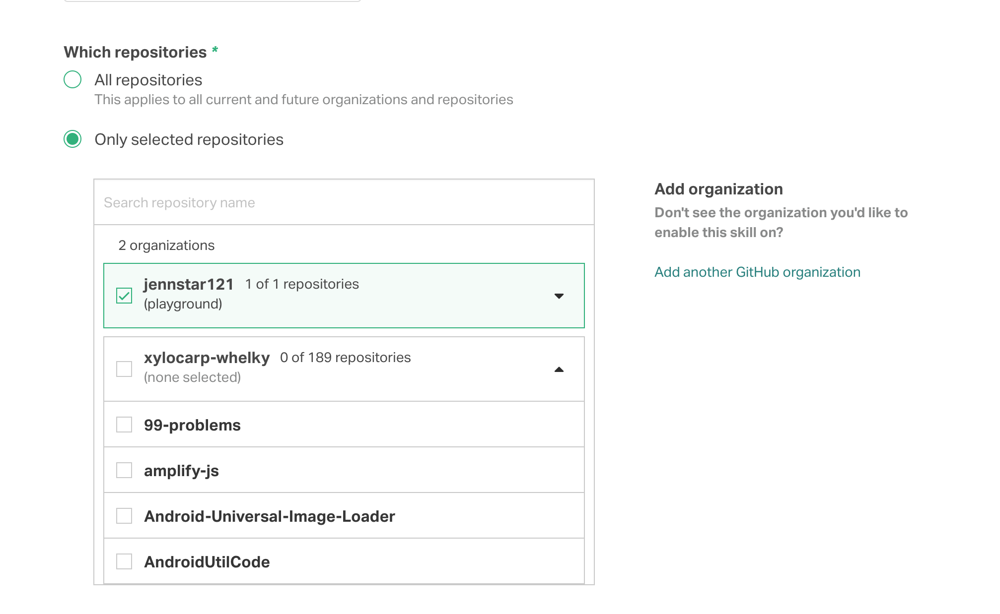

## Before you get started

Connect and configure these integrations:

1.  [**GitHub**](https://go.atomist.com/catalog/integration/github "GitHub Integration")
    _(required)_
1.  [**npm Registry**](https://go.atomist.com/catalog/integration/npmjs-registry "npm Registry Integration")
    _(required)_

## How to configure

1.  **NPM Registry**

    

    Select the npm registry from the list of available registries. If you have
    not already configured an npm registry, only your GitHub organizations, via
    the GitHub Packages npm registry, will appear in the list.

1.  **Package access**

    

    By default, packages will be published as publicly-accessible. If you want
    the package to be private, select the restricted access check box.

1.  **Determine repository scope**

    

    By default, this skill will be enabled for all repositories in all
    organizations you have connected.

    To restrict the organizations or specific repositories on which the skill
    will run, you can explicitly choose organizations and repositories.

1.  **Activate the skill**

    Save your configuration and activate the skill by clicking the "Enable
    skill" button.
